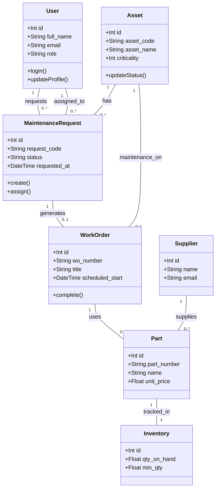

# UML Class Diagram - CMMS System

This diagram represents the logical structure of the CMMS application, showing the main entities and their relationships.

## Description of Entities
- **User**: Represents system users with specific roles (Admin, Technician, etc.).
- **Asset**: The equipment or machinery being maintained.
- **MaintenanceRequest**: An initial request for maintenance work.
- **WorkOrder**: A formalized task or set of tasks for maintenance.
- **Part**: Replacement parts or consumables used in maintenance.
- **Inventory**: Storage and quantity tracking for parts.
- **Supplier**: Vendors providing parts and services.
