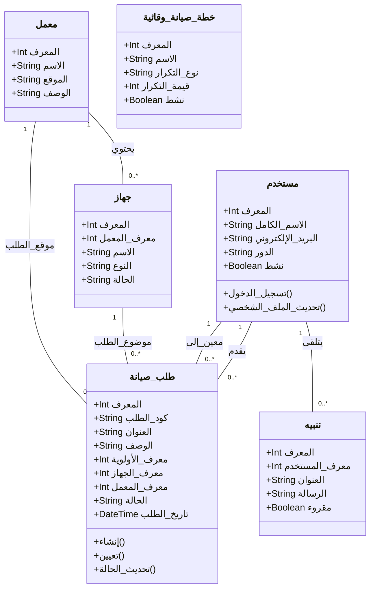

# مخطط الفئات (Class Diagram) - نظام CMMS

```mermaid
classDiagram
    class مستخدم {
        +Int المعرف
        +String الاسم_الكامل
        +String البريد_الإلكتروني
        +String الدور
        +Boolean نشط
        +تسجيل_الدخول()
        +تحديث_الملف_الشخصي()
    }

    class معمل {
        +Int المعرف
        +String الاسم
        +String الموقع
        +String الوصف
    }

    class جهاز {
        +Int المعرف
        +Int معرف_المعمل
        +String الاسم
        +String النوع
        +String الحالة
    }

    class طلب_صيانة {
        +Int المعرف
        +String كود_الطلب
        +String العنوان
        +String الوصف
        +Int معرف_الأولوية
        +Int معرف_الجهاز
        +Int معرف_المعمل
        +String الحالة
        +DateTime تاريخ_الطلب
        +إنشاء()
        +تعيين()
        +تحديث_الحالة()
    }

    class خطة_صيانة_وقائية {
        +Int المعرف
        +String الاسم
        +String نوع_التكرار
        +Int قيمة_التكرار
        +Boolean نشط
    }

    class تنبيه {
        +Int المعرف
        +Int معرف_المستخدم
        +String العنوان
        +String الرسالة
        +Boolean مقروء
    }

    مستخدم "1" -- "0..*" طلب_صيانة : يقدم
    مستخدم "1" -- "0..*" طلب_صيانة : معين_إلى
    معمل "1" -- "0..*" جهاز : يحتوي
    جهاز "1" -- "0..*" طلب_صيانة : موضوع_الطلب
    معمل "1" -- "0..*" طلب_صيانة : موقع_الطلب
    مستخدم "1" -- "0..*" تنبيه : يتلقى
```
