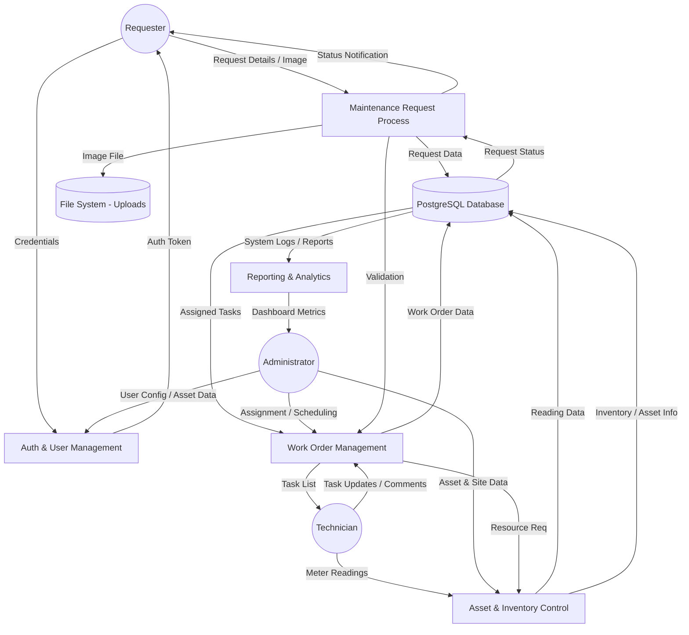

# Data Flow Diagram (DFD) - CMMS System

This diagram (Level 1) illustrates the flow of data between the external entities and the internal processes of the CMMS.

## Data Flow Descriptions
1. **User Authentication**: Credentials flow from the user to the Auth process, which verifies against the Database and returns an Auth Token.
2. **Request Submission**: Requesters send issue descriptions and images. Images are stored in the File System, while metadata is stored in the Database.
3. **Work Order Execution**: Technicians receive task details from the database, perform maintenance, and send status updates and part usage data back to the database.
4. **Asset & Inventory Management**: Admins and Planners update asset registries and inventory levels in the database.
5. **Reporting**: The system pulls historical data from the database to generate dashboard metrics for administrators.
