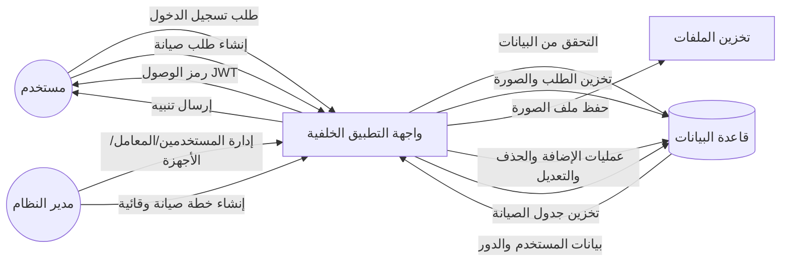

# مخطط تدفق البيانات (DFD) - نظام CMMS

```mermaid
graph LR
    مستخدم((مستخدم))
    مدير_النظام((مدير النظام))
    البوابة_الخلفية[واجهة التطبيق الخلفية]
    قاعدة_البيانات[(قاعدة البيانات)]
    تخزين_الملفات[تخزين الملفات]

    مستخدم -- "طلب تسجيل الدخول" --> البوابة_الخلفية
    البوابة_الخلفية -- "التحقق من البيانات" --> قاعدة_البيانات
    قاعدة_البيانات -- "بيانات المستخدم والدور" --> البوابة_الخلفية
    البوابة_الخلفية -- "رمز الوصول JWT" --> مستخدم

    مستخدم -- "إنشاء طلب صيانة" --> البوابة_الخلفية
    البوابة_الخلفية -- "تخزين الطلب والصورة" --> قاعدة_البيانات
    البوابة_الخلفية -- "حفظ ملف الصورة" --> تخزين_الملفات
    
    البوابة_الخلفية -- "إرسال تنبيه" --> مستخدم
    
    مدير_النظام -- "إدارة المستخدمين/المعامل/الأجهزة" --> البوابة_الخلفية
    البوابة_الخلفية -- "عمليات الإضافة والحذف والتعديل" --> قاعدة_البيانات
    
    مدير_النظام -- "إنشاء خطة صيانة وقائية" --> البوابة_الخلفية
    البوابة_الخلفية -- "تخزين جدول الصيانة" --> قاعدة_البيانات
```
