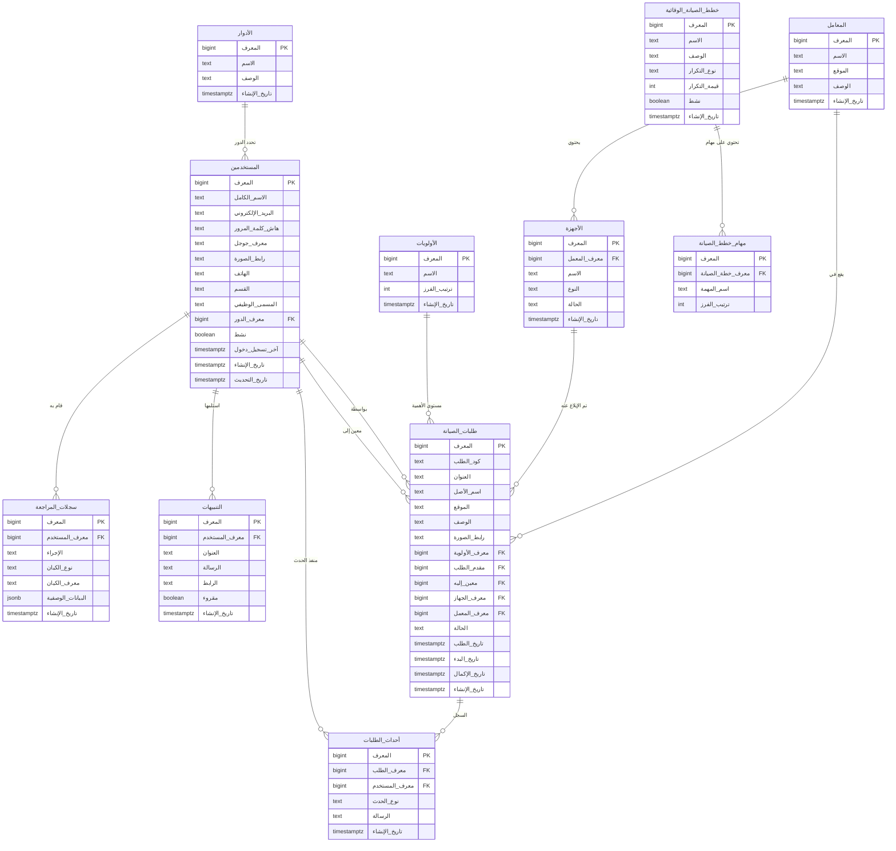

# مخطط علاقات الكيانات (ERD) - نظام CMMS

```mermaid
erDiagram
    الأدوار ||--o{ المستخدمين : "تحدد الدور"
    المستخدمين ||--o{ سجلات_المراجعة : "قام به"
    المستخدمين ||--o{ التنبيهات : "استلمها"
    المعامل ||--o{ الأجهزة : "يحتوي"
    المعامل ||--o{ طلبات_الصيانة : "يقع في"
    الأجهزة ||--o{ طلبات_الصيانة : "تم الإبلاغ عنه"
    الأولويات ||--o{ طلبات_الصيانة : "مستوى الأهمية"
    المستخدمين ||--o{ طلبات_الصيانة : "بواسطة"
    المستخدمين ||--o{ طلبات_الصيانة : "معين إلى"
    طلبات_الصيانة ||--o{ أحداث_الطلبات : "السجل"
    المستخدمين ||--o{ أحداث_الطلبات : "منفذ الحدث"
    خطط_الصيانة_الوقائية ||--o{ مهام_خطط_الصيانة : "تحتوي على مهام"

    الأدوار {
        bigint المعرف PK
        text الاسم
        text الوصف
        timestamptz تاريخ_الإنشاء
    }
    المستخدمين {
        bigint المعرف PK
        text الاسم_الكامل
        text البريد_الإلكتروني
        text هاش_كلمة_المرور
        text معرف_جوجل
        text رابط_الصورة
        text الهاتف
        text القسم
        text المسمى_الوظيفي
        bigint معرف_الدور FK
        boolean نشط
        timestamptz آخر_تسجيل_دخول
        timestamptz تاريخ_الإنشاء
        timestamptz تاريخ_التحديث
    }
    المعامل {
        bigint المعرف PK
        text الاسم
        text الموقع
        text الوصف
        timestamptz تاريخ_الإنشاء
    }
    الأجهزة {
        bigint المعرف PK
        bigint معرف_المعمل FK
        text الاسم
        text النوع
        text الحالة
        timestamptz تاريخ_الإنشاء
    }
    طلبات_الصيانة {
        bigint المعرف PK
        text كود_الطلب
        text العنوان
        text اسم_الأصل
        text الموقع
        text الوصف
        text رابط_الصورة
        bigint معرف_الأولوية FK
        bigint مقدم_الطلب FK
        bigint معين_إليه FK
        bigint معرف_الجهاز FK
        bigint معرف_المعمل FK
        text الحالة
        timestamptz تاريخ_الطلب
        timestamptz تاريخ_البدء
        timestamptz تاريخ_الإكمال
        timestamptz تاريخ_الإنشاء
    }
    أحداث_الطلبات {
        bigint المعرف PK
        bigint معرف_الطلب FK
        bigint معرف_المستخدم FK
        text نوع_الحدث
        text الرسالة
        timestamptz تاريخ_الإنشاء
    }
    التنبيهات {
        bigint المعرف PK
        bigint معرف_المستخدم FK
        text العنوان
        text الرسالة
        text الرابط
        boolean مقروء
        timestamptz تاريخ_الإنشاء
    }
    خطط_الصيانة_الوقائية {
        bigint المعرف PK
        text الاسم
        text الوصف
        text نوع_التكرار
        int قيمة_التكرار
        boolean نشط
        timestamptz تاريخ_الإنشاء
    }
    مهام_خطط_الصيانة {
        bigint المعرف PK
        bigint معرف_خطة_الصيانة FK
        text اسم_المهمة
        int ترتيب_الفرز
    }
    سجلات_المراجعة {
        bigint المعرف PK
        bigint معرف_المستخدم FK
        text الإجراء
        text نوع_الكيان
        text معرف_الكيان
        jsonb البيانات_الوصفية
        timestamptz تاريخ_الإنشاء
    }
    الأولويات {
        bigint المعرف PK
        text الاسم
        int ترتيب_الفرز
        timestamptz تاريخ_الإنشاء
    }
```
