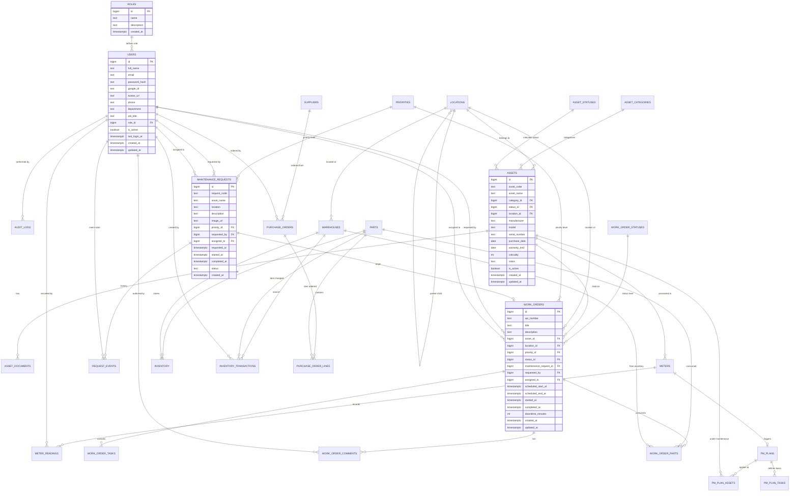

# Entity Relationship Diagram (ERD) - CMMS System

This diagram illustrates the database schema and the relationships between tables.

```mermaid
erDiagram
    ROLES ||--o{ USERS : "defines role"
    USERS ||--o{ AUDIT_LOGS : "performed by"
    LOCATIONS ||--o{ LOCATIONS : "parent-child"
    LOCATIONS ||--o{ ASSETS : "belongs to"
    ASSET_CATEGORIES ||--o{ ASSETS : "categorizes"
    ASSET_STATUSES ||--o{ ASSETS : "indicates status"
    ASSETS ||--o{ ASSET_DOCUMENTS : "has"
    ASSETS ||--o{ METERS : "connected to"
    METERS ||--o{ METER_READINGS : "records"
    USERS ||--o{ METER_READINGS : "recorded by"
    PRIORITIES ||--o{ MAINTENANCE_REQUESTS : "priority level"
    USERS ||--o{ MAINTENANCE_REQUESTS : "requested by"
    USERS ||--o{ MAINTENANCE_REQUESTS : "assigned to"
    MAINTENANCE_REQUESTS ||--o{ REQUEST_EVENTS : "history"
    USERS ||--o{ REQUEST_EVENTS : "event actor"
    WORK_ORDER_STATUSES ||--o{ WORK_ORDERS : "status level"
    ASSETS ||--o{ WORK_ORDERS : "task on"
    LOCATIONS ||--o{ WORK_ORDERS : "location of"
    PRIORITIES ||--o{ WORK_ORDERS : "priority level"
    MAINTENANCE_REQUESTS ||--o| WORK_ORDERS : "origin"
    USERS ||--o{ WORK_ORDERS : "requested by"
    USERS ||--o{ WORK_ORDERS : "assigned to"
    WORK_ORDERS ||--o{ WORK_ORDER_TASKS : "contains"
    WORK_ORDERS ||--o{ WORK_ORDER_COMMENTS : "has"
    USERS ||--o{ WORK_ORDER_COMMENTS : "authored by"
    PARTS ||--o{ INVENTORY : "tracked"
    WAREHOUSES ||--o{ INVENTORY : "stores"
    LOCATIONS ||--o{ WAREHOUSES : "located at"
    WAREHOUSES ||--o{ INVENTORY_TRANSACTIONS : "source"
    PARTS ||--o{ INVENTORY_TRANSACTIONS : "item changed"
    USERS ||--o{ INVENTORY_TRANSACTIONS : "created by"
    WORK_ORDERS ||--o{ WORK_ORDER_PARTS : "consumes"
    PARTS ||--o{ WORK_ORDER_PARTS : "consumed"
    WAREHOUSES ||--o{ WORK_ORDER_PARTS : "from inventory"
    SUPPLIERS ||--o{ PURCHASE_ORDERS : "ordered from"
    USERS ||--o{ PURCHASE_ORDERS : "ordered by"
    PURCHASE_ORDERS ||--o{ PURCHASE_ORDER_LINES : "contains"
    PARTS ||--o{ PURCHASE_ORDER_LINES : "item ordered"
    METERS ||--o| PM_PLANS : "triggers"
    PM_PLANS ||--o{ PM_PLAN_ASSETS : "applies to"
    ASSETS ||--o{ PM_PLAN_ASSETS : "under maintenance"
    PM_PLANS ||--o{ PM_PLAN_TASKS : "defines tasks"

    ROLES {
        bigint id PK
        text name
        text description
        timestamptz created_at
    }
    USERS {
        bigint id PK
        text full_name
        text email
        text password_hash
        text google_id
        text avatar_url
        text phone
        text department
        text job_title
        bigint role_id FK
        boolean is_active
        timestamptz last_login_at
        timestamptz created_at
        timestamptz updated_at
    }
    ASSETS {
        bigint id PK
        text asset_code
        text asset_name
        bigint category_id FK
        bigint status_id FK
        bigint location_id FK
        text manufacturer
        text model
        text serial_number
        date purchase_date
        date warranty_end
        int criticality
        text notes
        boolean is_active
        timestamptz created_at
        timestamptz updated_at
    }
    MAINTENANCE_REQUESTS {
        bigint id PK
        text request_code
        text asset_name
        text location
        text description
        text image_url
        bigint priority_id FK
        bigint requested_by FK
        bigint assigned_to FK
        timestamptz requested_at
        timestamptz started_at
        timestamptz completed_at
        text status
        timestamptz created_at
    }
    WORK_ORDERS {
        bigint id PK
        text wo_number
        text title
        text description
        bigint asset_id FK
        bigint location_id FK
        bigint priority_id FK
        bigint status_id FK
        bigint maintenance_request_id FK
        bigint requested_by FK
        bigint assigned_to FK
        timestamptz scheduled_start_at
        timestamptz scheduled_end_at
        timestamptz started_at
        timestamptz completed_at
        int downtime_minutes
        timestamptz created_at
        timestamptz updated_at
    }
```
