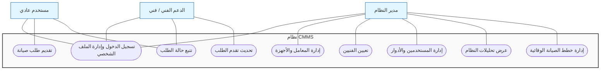

# مخطط حالات الاستخدام (Use Case Diagram) - نظام CMMS

```mermaid
flowchart TD
    %% Use Case Diagram using Flowchart syntax for maximum compatibility
    
    subgraph النظام ["نظام CMMS"]
        direction TB
        UC1([تسجيل الدخول وإدارة الملف الشخصي])
        UC2([تقديم طلب صيانة])
        UC3([تتبع حالة الطلب])
        UC4([إدارة المعامل والأجهزة])
        UC5([تعيين الفنيين])
        UC6([إدارة المستخدمين والأدوار])
        UC7([تحديث تقدم الطلب])
        UC8([عرض تحليلات النظام])
        UC9([إدارة خطط الصيانة الوقائية])
    end

    مستخدم[مستخدم عادي]
    مدير[مدير النظام]
    فني[الدعم الفني / فني]

    %% User Interactions
    مستخدم --- UC1
    مستخدم --- UC2
    مستخدم --- UC3

    %% Technician Interactions
    فني --- UC1
    فني --- UC3
    فني --- UC7

    %% Admin Interactions
    مدير --- UC1
    مدير --- UC4
    مدير --- UC5
    مدير --- UC6
    مدير --- UC8
    مدير --- UC9

    %% Styling for better visualization
    style النظام fill:#f9f9f9,stroke:#333,stroke-width:2px
    style مستخدم fill:#e1f5fe,stroke:#01579b
    style فني fill:#e1f5fe,stroke:#01579b
    style مدير fill:#e1f5fe,stroke:#01579b
```
